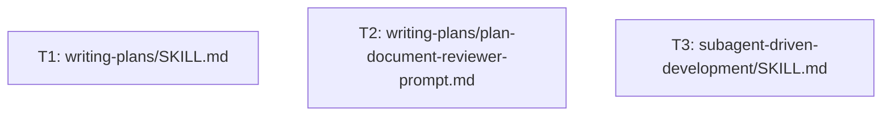
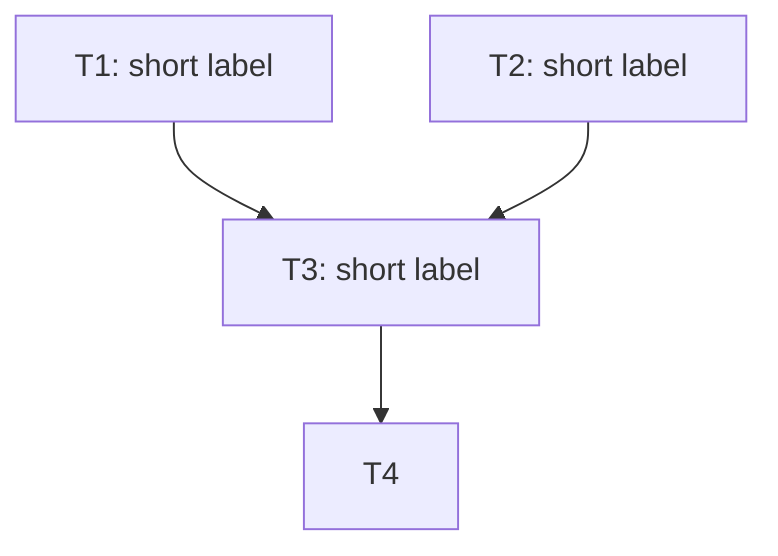
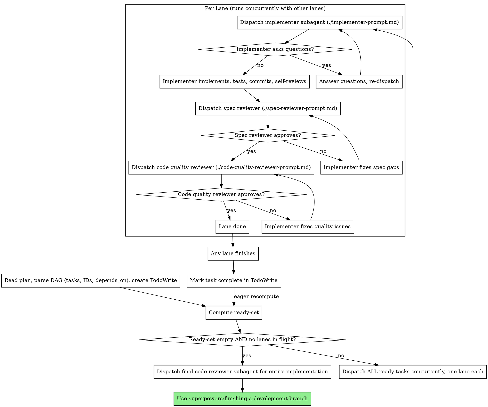

# Writing-Plans DAG 기반 실행 구현 플랜

> **For agentic workers:** REQUIRED SUB-SKILL: Use superpowers:subagent-driven-development (recommended) or superpowers:executing-plans to implement this plan task-by-task. Steps use checkbox (`- [ ]`) syntax for tracking.

**Goal:** `writing-plans`와 `subagent-driven-development` 스킬을 개조하여, Linear/Parallel 선택 분기를 제거하고 DAG 기반 ready-set 병렬 실행을 단일 워크플로우로 통합한다.

**Architecture:** 3개의 마크다운 스킬 파일을 독립적으로 수정한다. 각 파일은 다른 파일을 참조하지 않으므로 모든 태스크가 첫 라운드부터 동시에 ready 상태가 된다. 코드 변경은 없으며 스킬 문서 편집만 이루어진다.

**Tech Stack:** Markdown only. 스킬 파일은 `skills/<name>/SKILL.md` 형식.

**Spec:** `spec.md`

---

## Dependency Graph



세 태스크 모두 독립적이며 의존성이 없다. 첫 라운드에 동시에 디스패치한다.

---

## File Structure

| 파일 | 변경 종류 | 담당 태스크 |
|---|---|---|
| `skills/writing-plans/SKILL.md` | 수정 | T1 |
| `skills/writing-plans/plan-document-reviewer-prompt.md` | 수정 | T2 |
| `skills/subagent-driven-development/SKILL.md` | 수정 | T3 |

각 태스크는 단일 파일만 수정하므로 같은 라운드의 다른 lane과 파일 충돌이 없다.

---

## Task T1: `writing-plans/SKILL.md` 개조

**ID:** T1
**Depends on:** []

**Files:**
- Modify: `skills/writing-plans/SKILL.md`

### 변경 개요
- "Scope Check" 섹션의 Linear/Parallel 비교 문단 및 "Two execution options" 박스 제거
- "File Structure" 섹션 앞에 "Dependency DAG" 섹션 신설
- "Plan Document Header" 섹션의 헤더 템플릿에 `## Dependency Graph` Mermaid 항목 추가
- "Task Structure" 섹션의 자유서술 Dependencies 단락을 `ID:` / `Depends on:` 필드로 교체
- "Execution Handoff" 섹션의 Linear/Parallel 분기를 단일 핸드오프 문장으로 교체

---

- [ ] **Step 1: "Scope Check" 섹션에서 Linear/Parallel 분기 제거**

다음 두 단락 전체를 삭제한다.

삭제 대상 1 (현재 줄 25 부근부터 시작):
```
If the spec is a single system but can broken down into some components, you should consider the parallel-development approach. Compare two approaches: 
1. Linear plan - each step of the plan depends on the previous one; dispatch & execute the plan topdown
2. Parallel plan - make a multiple step plan, but a single step can be broken down into multiple substep which are mutually exclusive so they can execute with each other

This should be determined before you write the plan. 
Offer execution choice to user with your recommendation. 
```

삭제 대상 2 (그 직후):
```
**Two execution options:**

**1. Subagent-Driven - Linear** - I dispatch a fresh subagent per task, review between tasks, fast iteration

**2. Subagent-Driven - Parallel** - I dispatch multiple subagents that simulatenously handle jobs, and review once at the end
```

삭제 후 "Scope Check" 섹션의 마지막 단락은 첫 단락(`If the spec covers multiple independent subsystems...`)만 남아야 한다.

- [ ] **Step 2: "Dependency DAG" 섹션 신설**

`## Scope Check` 섹션과 `## File Structure` 섹션 사이에 다음 섹션을 정확히 그대로 삽입한다.

````markdown
## Dependency DAG

Before defining tasks, identify every task and the artifacts each one produces. For each task, list which earlier tasks' artifacts it depends on. Use these edges to build a **DAG** (directed acyclic graph) over the tasks.

- If you find a cycle, your decomposition is wrong — go back and split or merge tasks until the dependencies form a DAG.
- **Tasks that can be ready at the same time MUST modify disjoint sets of files.** If two tasks that could become ready concurrently would touch the same file, add a dependency edge to serialize them. Concurrent lanes touching the same file are a plan defect, not an executor problem.
- A purely linear chain (T1 → T2 → T3) is a valid DAG. The executor will simply have a ready-set of size 1 each round. There is no separate "linear" mode.

The DAG is then expressed in two complementary forms in the plan document: a Mermaid diagram in the header (overview) and explicit `Depends on:` fields on each task (per-task ground truth). Both must agree.

````

- [ ] **Step 3: "Plan Document Header" 템플릿에 Mermaid 섹션 추가**

현재 헤더 템플릿의 `**Tech Stack:** [Key technologies/libraries]` 줄과 그 아래 `---` 사이에 다음을 정확히 그대로 삽입한다.

````markdown

## Dependency Graph



The edges in this diagram MUST exactly match the `Depends on:` fields in each task below. Node IDs in the diagram are the same task IDs used in task headers.

````

- [ ] **Step 4: "Task Structure" 섹션 교체**

현재 "Task Structure" 섹션 본문(코드 블록 포함)을 다음으로 교체한다.

````markdown
## Task Structure

````markdown
### Task TN: [Component Name]

**ID:** TN
**Depends on:** [TA, TB, TC]

**Files:**
- Create: `exact/path/to/file.py`
- Modify: `exact/path/to/existing.py:123-145`

- [ ] Write minimal implementation

```python
def return_fibonacci_add_one(input):
    # Write down the logic that computes input-th fiboanacci number and store it to t
    t = t + 1
    return expected
```

- [ ] **Commit**

```bash
git commit -m "feat: add fibonacci add one computing method"
```
````

Rules:
- `ID:` must be unique across the plan and must match a node ID in the Mermaid Dependency Graph at the top.
- `Depends on:` is a list of other task IDs. Use `[]` for tasks with no dependencies — these become ready immediately in the first round.
- The set of edges across all `Depends on:` fields MUST exactly match the edges in the Mermaid diagram.
- Tasks with overlapping file scopes MUST have a dependency edge between them (see "Dependency DAG" section above).
````

- [ ] **Step 5: "Execution Handoff" 섹션 단순화**

현재 "Execution Handoff" 섹션 전체(헤더 포함, `## Execution Handoff` 부터 파일 끝까지) 를 다음으로 교체한다.

```markdown
## Execution Handoff

**REQUIRED SUB-SKILL:** Use `superpowers:subagent-driven-development`.

The plan's DAG defines parallelizable ready-sets. The executor parses the DAG, computes the ready-set each round, and dispatches all ready tasks concurrently as independent lanes. Each lane runs the standard per-task pipeline (implementer → spec reviewer → code quality reviewer) internally serial. When any lane finishes, the executor recomputes the ready-set immediately (eager recomputation) so newly-unblocked tasks start without waiting for the rest of the current round.

There is no Linear vs Parallel choice — a linear chain is just a DAG whose ready-set has size 1 each round, and the same skill handles both shapes.
```

- [ ] **Step 6: Commit**

```bash
git add skills/writing-plans/SKILL.md
git commit -m "feat(writing-plans): replace Linear/Parallel choice with DAG-based plan structure"
```

---

## Task T2: `writing-plans/plan-document-reviewer-prompt.md` 개조

**ID:** T2
**Depends on:** []

**Files:**
- Modify: `skills/writing-plans/plan-document-reviewer-prompt.md`

### 변경 개요
"What to Check" 표에 DAG 구조·Mermaid 일치·파일 격리 세 항목을 추가한다.

---

- [ ] **Step 1: "What to Check" 표 확장**

현재 표:
```
    | Category | What to Look For |
    |----------|------------------|
    | Completeness | TODOs, placeholders, incomplete tasks, missing steps |
    | Spec Alignment | Plan covers spec requirements, no major scope creep |
    | Task Decomposition | Tasks have clear boundaries, steps are actionable |
    | Buildability | Could an engineer follow this plan without getting stuck? |
```

위 표 바로 아래(같은 들여쓰기, 표의 마지막 줄 다음)에 다음 세 줄을 추가한다.

```
    | DAG Structure | Every task has `ID:` and `Depends on:` fields; IDs are unique; dependencies form a DAG with no cycles |
    | Mermaid Consistency | The edge set in the header's Mermaid `Dependency Graph` exactly matches the union of all `Depends on:` fields |
    | File Isolation | Tasks that could be ready at the same time (no dependency path between them) do not modify the same files |
```

들여쓰기와 파이프 정렬은 기존 표의 컨벤션을 그대로 따른다.

- [ ] **Step 2: Commit**

```bash
git add skills/writing-plans/plan-document-reviewer-prompt.md
git commit -m "feat(writing-plans): add DAG structure checks to plan reviewer prompt"
```

---

## Task T3: `subagent-driven-development/SKILL.md` 개조

**ID:** T3
**Depends on:** []

**Files:**
- Modify: `skills/subagent-driven-development/SKILL.md`

### 변경 개요
- Overview의 Core Principle에 "DAG ready-set parallel dispatch" 명시
- Process 다이어그램의 메인 루프 교체 (순차 → ready-set 기반)
- 본문에 Lanes-run-in-parallel / Eager recomputation / DAG-is-the-truth 원칙 추가
- Red Flags: 병렬 디스패치 금지 항목 제거, DAG 관련 신규 항목 3개 추가
- Example Workflow를 DAG 예시로 교체
- "vs. Executing Plans" 비교 박스 갱신

---

- [ ] **Step 1: Core Principle 문장 수정**

현재 줄(파일 상단):
```
**Core principle:** Fresh subagent per task + two-stage review (spec then quality) = high quality, fast iteration
```

다음으로 교체:
```
**Core principle:** Fresh subagent per task + two-stage review (spec then quality) + **DAG ready-set parallel dispatch** = high quality, fast iteration
```

- [ ] **Step 2: Process 다이어그램 교체**

`## The Process` 섹션 전체의 `dot` 코드 블록을 다음 의사 흐름으로 교체한다. 기존 `digraph process { ... }` 블록을 통째로 다음 블록으로 대체한다.

````markdown

````

- [ ] **Step 3: "DAG Execution Principles" 본문 추가**

위에서 교체한 Process 다이어그램 바로 아래에 다음 본문을 추가한다.

````markdown
### DAG Execution Principles

- **Lanes run in parallel; each lane is serial.** Inside a single lane, the implementer → spec review → code quality review steps run sequentially. Across lanes, the per-task pipelines run concurrently. There is no parallelism *within* a task — only across independent tasks.
- **Eager recomputation.** The instant any lane finishes, recompute the ready-set and dispatch any newly-unblocked tasks immediately. Do NOT wait for the rest of the current round to complete — that throws away parallelism the DAG made available.
- **The DAG is the truth.** Concurrent lane safety depends entirely on the plan's DAG correctly expressing dependencies. If two ready tasks would modify the same file, that is a **plan defect** — stop, report it to the user, and do not paper over it by serializing dispatch.
````

- [ ] **Step 4: Red Flags 갱신**

`## Red Flags` 섹션의 `**Never:**` 리스트에서 다음 줄을 삭제한다.
```
- Dispatch multiple implementation subagents in parallel (conflicts)
```

같은 리스트의 끝(`- Move to next task while either review has open issues` 다음)에 다음 세 줄을 추가한다.
```
- Dispatch a task whose dependencies haven't all completed
- Allow two concurrent lanes to touch the same file (this means the plan's DAG is wrong — stop and flag it to the user)
- Wait for the entire ready-set to finish before computing the next one (defeats DAG parallelism — recompute eagerly the moment any lane finishes)
```

- [ ] **Step 5: Example Workflow 교체**

`## Example Workflow` 섹션의 코드 블록 전체 내용을 다음으로 교체한다.

````
You: I'm using Subagent-Driven Development to execute this plan.

[Read plan file once: docs/superpowers/plans/feature-plan.md]
[Parse DAG: T1 (deps: []), T2 (deps: []), T3 (deps: [T1]), T4 (deps: [T2, T3])]
[Create TodoWrite with all 4 tasks]

Round 1: ready-set = {T1, T2}
[Dispatch T1 lane and T2 lane concurrently]

T1 lane: implementer asks "use user-level or system-level?"
You: "User level"
T1 implementer: implements, tests, commits, self-reviews
T1 spec reviewer: ✅
T1 code reviewer: ✅
T1 done.

[Eager recompute: ready-set = {T3} (T2 still in flight)]
[Dispatch T3 lane immediately — concurrent with still-running T2 lane]

T2 lane (still running): implementer commits
T2 spec reviewer: ❌ Missing progress reporting
T2 implementer: fixes
T2 spec reviewer: ✅
T2 code reviewer: ✅
T2 done.

[Eager recompute: ready-set = {} (T4 still waits on T3); T3 in flight]

T3 lane finishes: ✅✅ done.

[Eager recompute: ready-set = {T4}]
[Dispatch T4 lane]
T4 done.

[Ready-set empty, no lanes in flight → exit main loop]
[Dispatch final code-reviewer for entire implementation]
Final reviewer: All requirements met, ready to merge

Done!
````

- [ ] **Step 6: "vs. Executing Plans" 비교 박스 갱신**

`## When to Use` 섹션 아래의 `**vs. Executing Plans (parallel session):**` 불릿 리스트에서 다음 줄을 찾는다.
```
- Faster iteration (no human-in-loop between tasks)
```

이 줄 바로 위에 다음 줄을 추가한다.
```
- DAG ready-set parallel dispatch (lanes run concurrently)
```

- [ ] **Step 7: Commit**

```bash
git add skills/subagent-driven-development/SKILL.md
git commit -m "feat(subagent-driven-development): switch to DAG ready-set parallel dispatch"
```

---

## Verification (after all tasks complete)

이 플랜에는 자동화된 테스트가 없다(마크다운 문서만 수정). 모든 lane 완료 후 다음을 사람이 확인한다.

1. `skills/writing-plans/SKILL.md`에서 "Linear" 또는 "Parallel"이라는 단어가 분기 선택 문맥으로 등장하지 않는지 검색
2. `skills/writing-plans/SKILL.md`의 새 Plan Document Header 템플릿에 `## Dependency Graph` Mermaid 블록이 포함되어 있는지 확인
3. `skills/writing-plans/SKILL.md`의 Task Structure 예시에 `**ID:**`와 `**Depends on:**` 필드가 있는지 확인
4. `skills/subagent-driven-development/SKILL.md`의 Red Flags에서 "Dispatch multiple implementation subagents in parallel (conflicts)"가 사라졌는지 확인
5. `skills/subagent-driven-development/SKILL.md`에 "Eager recomputation" 단어가 등장하는지 확인
6. `skills/writing-plans/plan-document-reviewer-prompt.md`의 표에 "DAG Structure", "Mermaid Consistency", "File Isolation" 세 행이 있는지 확인

각 확인은 다음 grep으로 자동화 가능하다.

```bash
# 1
! grep -E "(Linear|Parallel)" skills/writing-plans/SKILL.md | grep -i "choose\|chosen\|option"
# 2
grep -A 2 "## Dependency Graph" skills/writing-plans/SKILL.md | grep "mermaid"
# 3
grep -E "^\*\*(ID|Depends on):\*\*" skills/writing-plans/SKILL.md
# 4
! grep "Dispatch multiple implementation subagents in parallel" skills/subagent-driven-development/SKILL.md
# 5
grep "Eager recomputation" skills/subagent-driven-development/SKILL.md
# 6
grep -E "DAG Structure|Mermaid Consistency|File Isolation" skills/writing-plans/plan-document-reviewer-prompt.md
```
