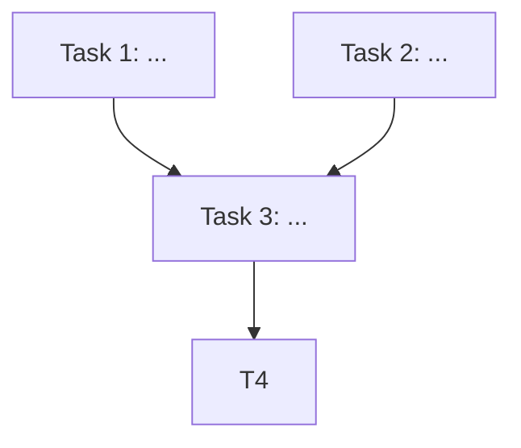

# Writing-Plans DAG 기반 실행 설계

## 배경

현재 `superpowers:writing-plans` 스킬은 플랜 작성 직전에 사용자에게 두 가지 실행 방식 중 하나를 강제로 선택하게 한다.

1. **Linear** — `subagent-driven-development`로 핸드오프, 태스크를 순차적으로 디스패치
2. **Parallel** — `dispatching-parallel-agents`로 핸드오프, 독립 태스크들을 한 번에 병렬로 디스패치

이 이분법은 두 가지 문제가 있다.

- **사용자 결정 부담:** 플랜을 보기도 전에 실행 방식을 정하라고 요구한다. 의사결정이 추측에 가까워진다.
- **표현력 부족:** 실제 작업은 "전부 직렬"이거나 "전부 병렬"인 경우가 거의 없다. 대부분은 일부 태스크가 의존성으로 묶이고 나머지는 동시에 진행 가능한 혼합 형태이다. Linear는 가능한 병렬성을 버리고, Parallel은 의존성 표현을 약화시킨다.

또한 두 핸드오프 타겟의 성숙도 차이가 크다. `subagent-driven-development`는 2단계 리뷰(spec → code quality), 재리뷰 루프, implementer status 처리(DONE / DONE_WITH_CONCERNS / NEEDS_CONTEXT / BLOCKED), 프롬프트 템플릿 3종, TodoWrite 통합, 모델 선택 가이드를 모두 갖춘 풍부한 워크플로우다. 반면 `dispatching-parallel-agents`는 ad-hoc 디버깅 패턴에 가깝고 위 인프라가 빠져 있다. 후자를 플랜 실행의 디폴트로 쓰면 품질 게이트가 사라진다.

## 목표

- 플랜 작성 시점에 **태스크 간 의존성을 DAG로 명시**한다.
- 실행 시점에는 **현재 의존성이 모두 충족된 ready-set의 모든 태스크를 항상 병렬로 디스패치**한다.
- Linear 케이스(순수 직선 체인)는 매 라운드 ready-set 크기가 1인 자연스러운 특수 케이스로 처리된다 — 별도 분기가 필요 없다.
- 기존의 2단계 리뷰·status 처리·프롬프트 템플릿 등 품질 인프라는 그대로 보존한다.

## 비목표

- `dispatching-parallel-agents` 스킬은 변경하지 않는다. 그것은 플랜 실행이 아닌 ad-hoc 디버깅 병렬화용으로 별도 보존한다.
- `implementer-prompt.md`, `spec-reviewer-prompt.md`, `code-quality-reviewer-prompt.md`는 변경하지 않는다. 모두 단일 태스크 단위로 동작하므로 DAG 도입과 직교한다.

## 설계

### Section 1: `skills/writing-plans/SKILL.md` 변경

#### 삭제
- "Scope Check" 섹션 후반부의 Linear vs Parallel 비교 문단과 "Two execution options" 박스
- "Execution Handoff" 섹션의 Linear/Parallel 분기 전체

#### 신설: "Dependency DAG" 섹션
"File Structure" 섹션 앞에 신설한다. 다음 내용을 명시한다.

- 플랜 작성 시 **모든 태스크를 먼저 식별**하고, 각 태스크가 어떤 선행 태스크의 산출물에 의존하는지 정리한다.
- 정리된 의존성으로 **DAG**(directed acyclic graph)를 구성한다. 사이클이 발견되면 태스크 분해를 다시 한다.
- **같은 DAG 레벨에 위치할 수 있는 태스크들(동시에 ready가 될 수 있는 태스크들)은 서로 다른 파일을 수정해야 한다.** 동일 파일을 동시에 수정하는 두 lane은 충돌을 일으키므로, 이 경우 한 쪽에 의존성을 추가해 직렬화한다.

#### 플랜 문서 헤더에 Mermaid DAG 추가
"Plan Document Header" 섹션에 다음 항목을 추가한다.

````markdown
## Dependency Graph


````

#### Task Structure 수정
현재 각 태스크의 자유 서술 "Dependencies" 단락을 구조화된 필드로 대체한다.

```markdown
### Task T3: [Component Name]

**ID:** T3
**Depends on:** [T1, T2]

**Files:**
- Create: `exact/path/to/file.py`
- Modify: `exact/path/to/existing.py:123-145`

- [ ] Write minimal implementation
  ...
```

- `ID:`는 Mermaid 다이어그램의 노드 ID와 정확히 일치해야 한다.
- `Depends on:`는 다른 태스크의 ID 리스트이며, 비어 있을 수 있다(`Depends on: []`).
- 의존성이 없는 태스크는 첫 라운드에 즉시 ready 상태가 된다.

#### Execution Handoff 단순화
분기 전체를 제거하고 다음 단일 문장으로 대체한다.

> **REQUIRED SUB-SKILL:** Use `superpowers:subagent-driven-development`. The plan's DAG defines parallelizable ready-sets; the executor dispatches all ready tasks concurrently each round.

### Section 2: `skills/subagent-driven-development/SKILL.md` 변경

#### Overview / Core Principle 수정
- 현재: "Fresh subagent per task + two-stage review (spec then quality) = high quality, fast iteration"
- 변경: "Fresh subagent per task + two-stage review (spec then quality) + **DAG ready-set parallel dispatch** = high quality, fast iteration"

#### Process 다이어그램 교체
현재의 "More tasks remain?" 단일 루프를 다음 구조로 교체한다.

```
Read plan
  ↓
Parse DAG: extract tasks, IDs, depends_on edges
  ↓
Create TodoWrite (one item per task)
  ↓
┌─ Main Loop ────────────────────────────────────────────────┐
│  Compute ready-set:                                        │
│    tasks whose deps are all completed AND not yet started  │
│                                                            │
│  Ready-set empty AND no lanes in flight?                   │
│    yes → break                                             │
│    no  → Dispatch ALL ready tasks concurrently             │
│          (one "lane" per task)                             │
│                                                            │
│  Wait for ANY lane to finish (not the whole round)         │
│    On completion → mark task done → recompute ready-set    │
└────────────────────────────────────────────────────────────┘
  ↓
Final reviewer subagent for entire implementation
  ↓
superpowers:finishing-a-development-branch
```

각 lane의 내부 동작은 기존과 동일하며, **lane 내부는 직렬**이다.

```
Lane (one task):
  Dispatch implementer
    → questions? → answer, redispatch
    → DONE / DONE_WITH_CONCERNS → continue
    → NEEDS_CONTEXT → provide context, redispatch
    → BLOCKED → escalate
  Dispatch spec reviewer
    → issues? → implementer fixes → re-review
    → approved → continue
  Dispatch code quality reviewer
    → issues? → implementer fixes → re-review
    → approved → mark task complete
```

#### 핵심 원칙 명시
다음을 본문에 추가한다.

- **Lanes run in parallel, but each lane is serial.** 한 태스크 내의 implementer → spec review → code quality review는 순차 진행이며, 이 시퀀스가 다른 태스크의 lane과 동시에 돌아간다.
- **Eager recomputation.** 한 lane이 끝나는 즉시 ready-set을 재계산하고 새로 ready가 된 태스크를 추가로 디스패치한다. 라운드 전체가 끝날 때까지 기다리지 않는다. 이렇게 해야 DAG의 병렬성을 최대로 활용한다.
- **The DAG is the truth.** lane 동시 실행의 안전성은 플랜의 DAG가 의존성을 정확히 표현한다는 가정에 의존한다. 두 ready 태스크가 같은 파일을 만진다면 그것은 **플랜 결함**이며, 즉시 사용자에게 보고한다.

#### Red Flags 수정
- **삭제:** "Dispatch multiple implementation subagents in parallel (conflicts)"
- **추가:**
  - "Dispatch a task whose dependencies haven't all completed"
  - "Two concurrent lanes touching the same file — this means the plan's DAG is incorrect; stop and flag the plan to the user"
  - "Wait for the entire ready-set to finish before computing the next one — defeats DAG parallelism; recompute eagerly per lane"

#### Example Workflow 교체
현재의 Task 1 → Task 2 직렬 예시를 DAG 예시로 교체한다. 예:

```
DAG:
  T1 (independent)
  T2 (independent)
  T3 depends on [T1]
  T4 depends on [T2, T3]

Round 1: ready = {T1, T2} → dispatch both lanes concurrently
T1 finishes first → mark done → ready becomes {T3}, dispatch T3 lane immediately
  (T2 still in flight; T3 lane runs concurrently with T2 lane)
T2 finishes → mark done → ready unchanged (T4 still waits on T3)
T3 finishes → mark done → ready = {T4}, dispatch T4 lane
T4 finishes → mark done → ready empty, no lanes in flight → exit loop
```

#### "vs. Executing Plans" 비교 박스 갱신
- "Sequential per task" → "Parallel per DAG ready-set"

#### When NOT to Use 다이어그램
- "Tasks mostly independent?" 분기는 그대로 유지한다. DAG로 표현 가능한 수준의 분해가 가능해야 이 스킬을 쓸 수 있다는 전제는 동일하다.

### Section 3: 부속 프롬프트 파일 변경

#### `skills/writing-plans/plan-document-reviewer-prompt.md`
"What to Check" 표에 다음 항목을 추가한다.

| Category | What to Look For |
|---|---|
| DAG 구조 | 모든 태스크가 `ID:`와 `Depends on:` 필드를 가짐, ID가 고유함, 의존성 그래프에 사이클 없음 |
| Mermaid 일치 | 다이어그램의 엣지 집합이 각 태스크의 `Depends on:` 필드와 정확히 일치 |
| 파일 격리 | 같은 DAG 레벨에서 동시에 ready가 될 수 있는 태스크들이 동일 파일을 수정하지 않음 |

#### `skills/subagent-driven-development/{implementer,spec-reviewer,code-quality-reviewer}-prompt.md`
**변경 없음.** 모두 단일 태스크 단위로 동작하므로 DAG 도입과 직교한다.

#### `skills/dispatching-parallel-agents/SKILL.md`
**변경 없음.** 이 스킬은 플랜 실행이 아닌 ad-hoc 디버깅 병렬화용으로 별도 보존한다.

## 영향 범위 요약

| 파일 | 변경 |
|---|---|
| `skills/writing-plans/SKILL.md` | 수정 — Scope Check 분기 제거, Dependency DAG 섹션 신설, Plan Header에 Mermaid 추가, Task Structure에 ID/Depends on 필드, Execution Handoff 단순화 |
| `skills/writing-plans/plan-document-reviewer-prompt.md` | 수정 — DAG 검증 항목 추가 |
| `skills/subagent-driven-development/SKILL.md` | 수정 — Process 다이어그램 교체, ready-set 메인 루프 명시, Red Flags 수정, Example Workflow 교체 |
| `skills/subagent-driven-development/implementer-prompt.md` | 변경 없음 |
| `skills/subagent-driven-development/spec-reviewer-prompt.md` | 변경 없음 |
| `skills/subagent-driven-development/code-quality-reviewer-prompt.md` | 변경 없음 |
| `skills/dispatching-parallel-agents/SKILL.md` | 변경 없음 |
