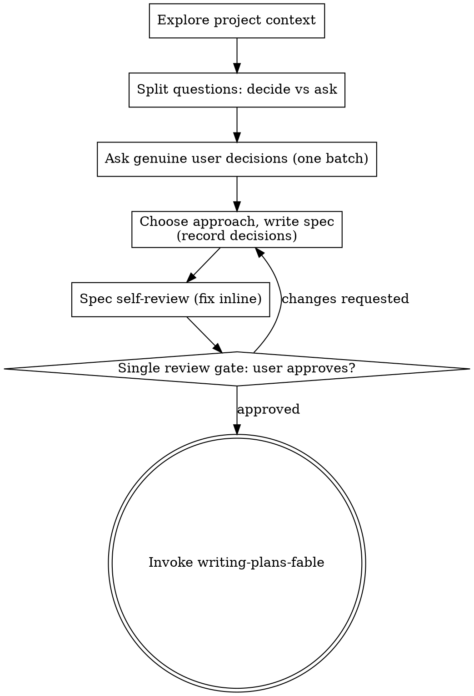

# Brainstorming Ideas Into Designs (Fable)

Turn ideas into fully formed designs and specs with minimal back-and-forth. You are trusted to make the calls that have a clear right answer; the user's attention is reserved for decisions only they can make.

**Decide first, report after.** That is the core difference from the non-Fable skill: instead of asking the user to confirm each choice, you make every choice that has a clearly recommendable answer, record it in the spec's Decisions section, and present everything for review **once**.

<HARD-GATE>
Do NOT invoke any implementation skill, write any code, scaffold any project, or take any implementation action until the user has approved the spec at the single review gate below. This applies to EVERY project regardless of perceived simplicity.
</HARD-GATE>

## Anti-Pattern: "This Is Too Simple To Need A Design"

Every project goes through this process. A todo list, a single-function utility, a config change — all of them. The spec can be short (a few sentences for truly simple projects), but you MUST write it and get approval once.

## Checklist

You MUST create a task for each of these items and complete them in order:

1. **Explore project context** — check files, docs, recent commits
2. **Resolve open questions** — decide clear-cut choices yourself; batch the genuine user decisions into one round of questions (see below)
3. **Choose the approach** — weigh 2-3 candidates internally, pick one, record the alternatives and reasoning in the spec
4. **Write design doc** — save to `docs/superpowers/YYYY-MM-DD/<topic>/spec.md` with a Decisions section
5. **Spec self-review** — inline check for placeholders, contradictions, ambiguity, scope
6. **Single review gate** — present a summary of the design and your autonomous decisions, ask the user to review the spec, wait for approval
7. **Transition to implementation** — invoke superpowers:writing-plans-fable

## Process Flow

**The terminal state is invoking writing-plans-fable.** Do NOT invoke frontend-design, mcp-builder, or any other implementation skill.

## Deciding vs. Asking

After exploring the project, list every open question the design raises, then split it:

- **Decide yourself** when one option is clearly more idiomatic, standard, or conventional — or when any reasonable engineer would pick the same thing. Default aggressively to this bucket: for Fable, the recommendation is usually the answer, and asking the user to rubber-stamp it wastes their attention.
- **Ask the user** only when the choice genuinely depends on them: a real trade-off with no conventional answer, a matter of taste, business/product context you cannot infer, or anything expensive to reverse if you guess wrong.
- When judging which option is more idiomatic, **the size of the code change is the LOWEST-priority factor.** Correct, clear, understandable code matters far more than keeping the change small.
- Ask the genuine user decisions **in one batch**, not one message at a time. If later exploration surfaces a new genuine user decision, ask it then — batching is the default, not a limit of one round.
- Every choice you make autonomously MUST appear in the spec's Decisions section: the options, your pick, and why. The single review gate is where the user overrides your calls — a silent decision robs them of that chance.

**Scope check before detailed questions:** if the request describes multiple independent subsystems, flag it immediately and help decompose into sub-projects. Each sub-project gets its own spec → plan → implementation cycle.

## Design Principles

- YAGNI ruthlessly — strip features the goal doesn't need
- Break the system into units with one clear purpose each, communicating through well-defined interfaces. For each unit you should be able to answer: what does it do, how do you use it, what does it depend on?
- In existing codebases, explore the current structure first and follow existing patterns. Include targeted improvements where existing problems affect the work; don't propose unrelated refactoring.

## The Spec Document

- Write the design to `docs/superpowers/YYYY-MM-DD/<topic>/spec.md`. Use Korean(한국어로 작성하십시오).
  - (User preferences for spec location override this default)
- Cover: architecture, components, data flow, error handling, testing — each section scaled to its complexity (a few sentences if straightforward)
- Include a **Decisions** section recording every autonomous choice: options considered, pick, reasoning — including the approach candidates you weighed and why the chosen one won

**Spec Self-Review** — after writing, look with fresh eyes and fix inline (no re-review needed):

1. **Placeholder scan:** any "TBD", "TODO", vague requirements? Fix them.
2. **Internal consistency:** do sections contradict each other?
3. **Scope check:** focused enough for a single implementation plan?
4. **Ambiguity check:** could any requirement be read two ways? Pick one and make it explicit.

## Single Review Gate

This is the ONE place the user approves. Present, in one message:

- A high-level summary of the design (a few sentences to a short section)
- The key autonomous decisions and one-line reasons, so they can be overridden cheaply
- A pointer to the spec file for the full detail

> "Spec written to `<path>`. I made the following calls autonomously — override any of them. Please review; once you approve, I'll write the implementation plan."

Wait for the response. If changes are requested, update the spec, re-run the self-review, and present again. Only proceed once the user approves.

**Implementation:** invoke superpowers:writing-plans-fable — the ONLY skill you invoke after brainstorming.

## Visual Companion

A browser-based companion for mockups, diagrams, and visual options. **Only on explicit user request** — never offer it yourself. When asked for, read the guide at `../brainstorming/visual-companion.md` first, and even then decide per question whether the content is genuinely visual (mockups, layouts, diagrams) or just text (use the terminal).
