# Subagent-Driven Development (Fable)

Execute a plan by dispatching a fresh subagent per task with **DAG ready-set parallel dispatch**. Compared to the non-Fable skill, the review pipeline is deliberately lean: only hard (opus-tier) tasks get a per-task spec review, there are no per-task code quality reviews, and one combined final review covers the whole implementation at the end. You — a Fable main agent — compensate by dispatching with better prompts and by reading implementer reports critically.

**Why subagents:** You delegate tasks to specialized agents with isolated context. By precisely crafting their instructions, you ensure they stay focused and succeed. They never inherit your session's context — you construct exactly what they need. This also preserves your own context for coordination.

**Core principle:** Fresh subagent per task + spec review for hard tasks only + one combined final review + DAG ready-set parallel dispatch = high quality at a fraction of the review cost.

**Continuous execution:** Do not pause to check in with your human partner between tasks. The only reasons to stop: a BLOCKED status you cannot resolve, a plan defect (e.g. two concurrently-ready tasks touching the same file), ambiguity that genuinely prevents progress, or all tasks complete.

## You Own the Detail

Plans written by superpowers:writing-plans-fable define each task's box — goal, files, contracts, constraints — and intentionally leave ordinary implementation detail to execution. **You fill that gap at dispatch time, not by loosening the box.** When dispatching an implementer:

- Paste the full task text (goal, contract, constraints) — never make the subagent read the plan file
- Add scene-setting the plan doesn't carry: where the task fits, what its dependencies actually built (from their reports), relevant codebase pointers or conventions you know
- If the task's box seems underspecified for the implementer's tier, add concrete guidance (an example, a signature, a pattern to follow) in the prompt — the plan's contracts are the floor, not the ceiling
- If you find a genuine contradiction or hole in the plan, resolve it yourself when the resolution is clear-cut (note it), or stop and ask when it isn't

## The Process

```dot
digraph process_fable {
    rankdir=TB;

    "Read plan, parse DAG, create TodoWrite" [shape=box];
    "Print one-line task summary" [shape=box];
    "Compute ready-set" [shape=box];
    "Ready-set empty AND nothing in flight?" [shape=diamond];
    "Dispatch ALL ready tasks concurrently, one lane each" [shape=box];
    "Dispatch combined final review (quality + integration + completeness)" [shape=box];
    "Final review approves?" [shape=diamond];
    "Dispatch fix subagent, re-review" [shape=box];
    "Use superpowers:finishing-a-development-branch" [shape=box style=filled fillcolor=lightgreen];

    subgraph cluster_lane {
        label="Per Lane (runs concurrently with other lanes)";
        "Dispatch implementer (../subagent-driven-development/implementer-prompt.md)" [shape=box];
        "Implementer asks questions?" [shape=diamond];
        "Answer, re-dispatch" [shape=box];
        "Implementer implements, tests, commits, self-reviews" [shape=box];
        "Eager-recompute ready-set (commit unblocks dependents)" [shape=box];
        "Hard (opus-tier) task or concerns flagged?" [shape=diamond];
        "Dispatch spec reviewer (../subagent-driven-development/spec-reviewer-prompt.md)" [shape=box];
        "Spec reviewer approves?" [shape=diamond];
        "Implementer fixes spec gaps" [shape=box];
        "Mark task complete in TodoWrite" [shape=box];
    }

    "Read plan, parse DAG, create TodoWrite" -> "Print one-line task summary";
    "Print one-line task summary" -> "Compute ready-set";
    "Compute ready-set" -> "Ready-set empty AND nothing in flight?";
    "Ready-set empty AND nothing in flight?" -> "Dispatch combined final review (quality + integration + completeness)" [label="yes"];
    "Ready-set empty AND nothing in flight?" -> "Dispatch ALL ready tasks concurrently, one lane each" [label="no"];
    "Dispatch ALL ready tasks concurrently, one lane each" -> "Dispatch implementer (../subagent-driven-development/implementer-prompt.md)";

    "Dispatch implementer (../subagent-driven-development/implementer-prompt.md)" -> "Implementer asks questions?";
    "Implementer asks questions?" -> "Answer, re-dispatch" [label="yes"];
    "Answer, re-dispatch" -> "Dispatch implementer (../subagent-driven-development/implementer-prompt.md)";
    "Implementer asks questions?" -> "Implementer implements, tests, commits, self-reviews" [label="no"];

    "Implementer implements, tests, commits, self-reviews" -> "Eager-recompute ready-set (commit unblocks dependents)";
    "Eager-recompute ready-set (commit unblocks dependents)" -> "Compute ready-set";
    "Implementer implements, tests, commits, self-reviews" -> "Hard (opus-tier) task or concerns flagged?" [label="review track (concurrent, non-blocking)"];
    "Hard (opus-tier) task or concerns flagged?" -> "Mark task complete in TodoWrite" [label="no"];
    "Hard (opus-tier) task or concerns flagged?" -> "Dispatch spec reviewer (../subagent-driven-development/spec-reviewer-prompt.md)" [label="yes"];
    "Dispatch spec reviewer (../subagent-driven-development/spec-reviewer-prompt.md)" -> "Spec reviewer approves?";
    "Spec reviewer approves?" -> "Implementer fixes spec gaps" [label="no"];
    "Implementer fixes spec gaps" -> "Dispatch spec reviewer (../subagent-driven-development/spec-reviewer-prompt.md)";
    "Spec reviewer approves?" -> "Mark task complete in TodoWrite" [label="yes"];
    "Mark task complete in TodoWrite" -> "Compute ready-set" [label="re-check exit condition"];

    "Dispatch combined final review (quality + integration + completeness)" -> "Final review approves?";
    "Final review approves?" -> "Dispatch fix subagent, re-review" [label="no"];
    "Dispatch fix subagent, re-review" -> "Dispatch combined final review (quality + integration + completeness)";
    "Final review approves?" -> "Use superpowers:finishing-a-development-branch" [shape=box];
}
```



### Task Summary at Start

After parsing the DAG and before dispatching anything, print a one-line summary of every task, in task-ID order:

```
[T1]: aaa (depends on [], sonnet)
[T2]: bbb (depends on [T1], haiku)
```

Pull the summary, `Depends on:`, and `Recommended agent:` straight from the plan. If a task has no recommended agent, choose one using the Model Selection rules and note it.

## Review Policy

This is where the Fable variant differs most. Reviews are targeted, not blanket:

- **Per-task spec review — hard tasks only.** Dispatch a spec reviewer (same model tier as the task) only when the task is opus-tier, when the implementer reported DONE_WITH_CONCERNS about correctness or scope, or when you have a concrete reason to distrust the result (suspiciously fast, touched more files than the plan said, report contradicts the task). For everything else, the implementer's self-review plus your critical read of its report is the review — read the report against the task's contract, don't rubber-stamp it.
- **No per-task code quality reviews.** Code quality is covered once, at the end, for everything.
- **One combined final review.** When the ready-set is empty and nothing is in flight, dispatch a single whole-implementation review using the code-reviewer template from superpowers:requesting-code-review (BASE_SHA = where the branch started, HEAD_SHA = the final commit, PLAN_OR_REQUIREMENTS = the plan file). Scope it to cover BOTH code quality (cleanliness, tests, maintainability, file organization) AND whole-implementation concerns (plan/requirements completeness, cross-task integration, architecture soundness, merge verdict). Use the most capable model (`opus`). This is the last gate before merge — never skip it, never finish the branch while it has open issues.

## DAG Execution Principles

- **Lanes run in parallel; each lane is serial.** There is no parallelism *within* a task — only across independent tasks.
- **Implementation commit unblocks dependents — reviews never gate them.** The instant an implementer commits, recompute the ready-set and dispatch newly-unblocked dependents immediately, while any spec review runs concurrently. Dependents build on committed code, not reviewed-and-blessed code.
- **Eager recomputation.** Recompute the ready-set the instant any implementer commits, and again whenever a review track finishes (to re-check the exit condition). Never wait for the rest of the round.
- **When a review demands a change, you decide where the fix lands — never revert or block.** Isolated fix → same implementer fixes, re-review. Breaking change that ripples into already-dispatched dependents → let in-flight lanes finish, then dispatch a follow-up fix reconciling them with the corrected interface.
- **Concurrent commits will race — retry, never amend.** Lanes retry commits up to three times and never rewrite shared history (implementers get this via the prompt template).
- **The DAG is the truth.** If two ready tasks would modify the same file, that is a plan defect — stop and report it, don't paper over it by serializing.
- **Optional cleanup suggestions are still worth doing.** When a subagent flags a non-blocking improvement (clearer name, small dedup), default to applying it via the same implementer. Only defer when genuinely out of scope, and record the follow-up instead of silently dropping it.

## Model Selection

- **Implementer — follow the plan.** Dispatch with the task's `Recommended agent:` tier. Override only when the plan clearly misjudged the difficulty, and say why. If no tier is given: mechanical/complete-spec/1-2 files → haiku; ordinary implementation with judgment → sonnet; design judgment, tricky algorithms, broad understanding → opus.
- **Spec reviewer (hard tasks only) — same tier as the task** (in practice, opus).
- **Combined final review — opus.**

## Handling Implementer Status

**DONE:** Read the report critically against the task's contract. Hard task → spec review; otherwise mark complete.

**DONE_WITH_CONCERNS:** Read the concerns. Correctness/scope concerns → address them (this is one of the triggers for a spec review on a non-hard task). Cheap in-scope cleanup suggestions → apply them; defer the rest as recorded follow-ups.

**NEEDS_CONTEXT:** Provide the missing context and re-dispatch.

**BLOCKED:** Assess: context problem → provide context and re-dispatch; needs more reasoning → re-dispatch with a more capable model; too large → break it into smaller pieces; plan itself is wrong → escalate to the human. **Never** force the same model to retry without changes.

## Prompt Templates

Shared with the non-Fable skill — do not duplicate them:

- `../subagent-driven-development/implementer-prompt.md` — implementer subagent (per task)
- `../subagent-driven-development/spec-reviewer-prompt.md` — spec compliance reviewer (hard/flagged tasks only)
- Combined final review — code-reviewer template from superpowers:requesting-code-review, scoped as described in Review Policy

## Red Flags

**Never:**
- Start implementation on main/master without explicit user consent
- Skip the spec review for an opus-tier task, or for a task whose implementer flagged correctness concerns
- Run a per-task code quality review (code quality is covered solely by the combined final review)
- Skip the combined final review, or finish the branch before it passes
- Mark a non-reviewed task complete without actually reading its report against the task's contract
- Make a subagent read the plan file (paste the full task text instead)
- Skip scene-setting context, or ignore subagent questions
- Accept "close enough" on a failed review — fix and re-review until approved
- Hold back a ready dependent because a review hasn't finished (the commit unblocks dependents)
- Revert an already-dispatched dependent lane because a review found a breaking change (reconcile with a follow-up fix instead)
- Amend/rebase in a lane, or give up on a racing commit after one failure
- Dispatch a task whose dependencies haven't all committed
- Allow two concurrent lanes to touch the same file (plan defect — stop and flag it)
- Wait for the entire ready-set to finish before recomputing (defeats DAG parallelism)

## Integration

**Required workflow skills:**
- **superpowers:using-git-worktrees** — isolated workspace
- **superpowers:writing-plans-fable** — creates the plan this skill executes
- **superpowers:requesting-code-review** — code-reviewer template for the combined final review
- **superpowers:finishing-a-development-branch** — after the final review passes

**Subagents should use:**
- **superpowers:test-driven-development** — only when a task explicitly calls for TDD

**Alternative workflow:**
- **superpowers:executing-plans** — for parallel-session execution instead of same-session
