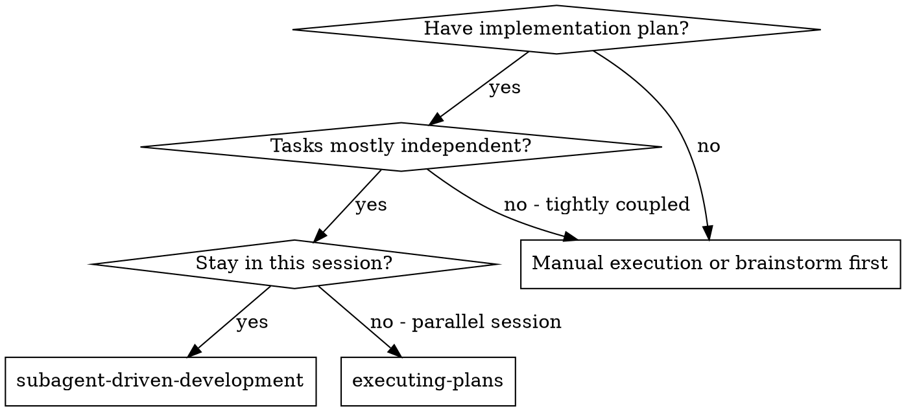

# Subagent-Driven Development

Execute plan by dispatching fresh subagent per task, with two-stage review after each: spec compliance review first, then code quality review.

**Why subagents:** You delegate tasks to specialized agents with isolated context. By precisely crafting their instructions and context, you ensure they stay focused and succeed at their task. They should never inherit your session's context or history — you construct exactly what they need. This also preserves your own context for coordination work.

**Core principle:** Fresh subagent per task + two-stage review (spec then quality) + **DAG ready-set parallel dispatch** = high quality, fast iteration

**Continuous execution:** Do not pause to check in with your human partner between tasks. Execute all tasks from the plan without stopping. The only reasons to stop are: BLOCKED status you cannot resolve, ambiguity that genuinely prevents progress, or all tasks complete. "Should I continue?" prompts and progress summaries waste their time — they asked you to execute the plan, so execute it.

## When to Use



**vs. Executing Plans (parallel session):**
- Same session (no context switch)
- Fresh subagent per task (no context pollution)
- Two-stage review after each task: spec compliance first, then code quality
- DAG ready-set parallel dispatch (lanes run concurrently)
- Faster iteration (no human-in-loop between tasks)

## The Process

```dot
digraph process {
    rankdir=TB;

    "Read plan, parse DAG (tasks, IDs, depends_on), create TodoWrite" [shape=box];
    "Compute ready-set" [shape=box];
    "Ready-set empty AND nothing in flight (implementers + reviews)?" [shape=diamond];
    "Dispatch ALL ready tasks concurrently, one lane each" [shape=box];
    "Dispatch final code reviewer subagent for entire implementation" [shape=box];
    "Use superpowers:finishing-a-development-branch" [shape=box style=filled fillcolor=lightgreen];

    subgraph cluster_lane {
        label="Per Lane (runs concurrently with other lanes)";
        "Dispatch implementer subagent (./implementer-prompt.md)" [shape=box];
        "Implementer asks questions?" [shape=diamond];
        "Answer questions, re-dispatch" [shape=box];
        "Implementer implements, tests, commits, self-reviews" [shape=box];
        "Eager-recompute ready-set (commit unblocks dependents)" [shape=box];
        "Dispatch spec reviewer (./spec-reviewer-prompt.md)" [shape=box];
        "Spec reviewer approves?" [shape=diamond];
        "Implementer fixes spec gaps" [shape=box];
        "Dispatch code quality reviewer (./code-quality-reviewer-prompt.md)" [shape=box];
        "Code quality reviewer approves?" [shape=diamond];
        "Implementer fixes quality issues" [shape=box];
        "Reviews passed (mark task complete in TodoWrite)" [shape=box];
    }

    "Read plan, parse DAG (tasks, IDs, depends_on), create TodoWrite" -> "Compute ready-set";
    "Compute ready-set" -> "Ready-set empty AND nothing in flight (implementers + reviews)?";
    "Ready-set empty AND nothing in flight (implementers + reviews)?" -> "Dispatch final code reviewer subagent for entire implementation" [label="yes"];
    "Ready-set empty AND nothing in flight (implementers + reviews)?" -> "Dispatch ALL ready tasks concurrently, one lane each" [label="no"];
    "Dispatch ALL ready tasks concurrently, one lane each" -> "Dispatch implementer subagent (./implementer-prompt.md)";

    "Dispatch implementer subagent (./implementer-prompt.md)" -> "Implementer asks questions?";
    "Implementer asks questions?" -> "Answer questions, re-dispatch" [label="yes"];
    "Answer questions, re-dispatch" -> "Dispatch implementer subagent (./implementer-prompt.md)";
    "Implementer asks questions?" -> "Implementer implements, tests, commits, self-reviews" [label="no"];

    "Implementer implements, tests, commits, self-reviews" -> "Eager-recompute ready-set (commit unblocks dependents)";
    "Eager-recompute ready-set (commit unblocks dependents)" -> "Compute ready-set";
    "Implementer implements, tests, commits, self-reviews" -> "Dispatch spec reviewer (./spec-reviewer-prompt.md)" [label="review track (concurrent, non-blocking)"];

    "Dispatch spec reviewer (./spec-reviewer-prompt.md)" -> "Spec reviewer approves?";
    "Spec reviewer approves?" -> "Implementer fixes spec gaps" [label="no"];
    "Implementer fixes spec gaps" -> "Dispatch spec reviewer (./spec-reviewer-prompt.md)";
    "Spec reviewer approves?" -> "Dispatch code quality reviewer (./code-quality-reviewer-prompt.md)" [label="yes"];
    "Dispatch code quality reviewer (./code-quality-reviewer-prompt.md)" -> "Code quality reviewer approves?";
    "Code quality reviewer approves?" -> "Implementer fixes quality issues" [label="no"];
    "Implementer fixes quality issues" -> "Dispatch code quality reviewer (./code-quality-reviewer-prompt.md)";
    "Code quality reviewer approves?" -> "Reviews passed (mark task complete in TodoWrite)" [label="yes"];
    "Reviews passed (mark task complete in TodoWrite)" -> "Compute ready-set" [label="re-check exit condition"];

    "Dispatch final code reviewer subagent for entire implementation" -> "Use superpowers:finishing-a-development-branch";
}
```



### DAG Execution Principles

- **Lanes run in parallel; each lane is serial.** Inside a single lane, the implementer → spec review → code quality review steps run in order. Across lanes, the per-task pipelines run concurrently. There is no parallelism *within* a task — only across independent tasks.
- **Implementation commit unblocks dependents — reviews do not gate them.** Spec review and code quality review are not on the critical path. The instant an implementer commits, treat its task as implementation-complete: recompute the ready-set and dispatch any newly-unblocked dependents immediately, *while that task's spec and quality reviews run concurrently*. Dependents build on the committed code, not on the reviewed-and-blessed code. This is the main lever for speed — a passing review rarely changes the code, so blocking downstream work on it wastes the parallelism the DAG made available.
- **Eager recomputation.** Recompute the ready-set the instant any implementer commits (this unblocks its dependents) and again whenever a review track finishes (to re-check the exit condition). Do NOT wait for the rest of the current round to complete.
- **When a review demands a change, you decide where the fix lands — never revert or block.** Reviews still matter: you never skip them, and you never finish the branch with open review issues. But because dependents may already be in flight, handle each finding by scope:
  - *Isolated to the reviewed task* (fix touches only that task's files): the same implementer fixes it, re-review, done. Dependents are unaffected.
  - *Breaking change that ripples into already-dispatched dependents* (e.g. an interface the dependents consumed changed): **you, the main agent, coordinate the fix directly.** Do NOT revert the dependent lanes or unwind the DAG. Let the in-flight lanes finish, then dispatch a follow-up fix — a new task or a targeted fix subagent — that reconciles the dependents with the corrected interface. A breaking finding is a normal event to absorb, not a reason to serialize the whole plan.
- **Concurrent commits will race — retry, never amend.** Multiple lanes commit to the same branch at once, so a commit can fail on a git lock or a non-fast-forward. That is expected: wait briefly and retry the commit, up to three attempts — the race almost always clears. Never rewrite shared history with `git commit --amend` or `git rebase` inside a lane; amending while other lanes commit scrambles the history for everyone. Always add a new commit. (Implementers get this instruction directly in `./implementer-prompt.md`.)
- **The DAG is the truth.** Concurrent lane safety depends entirely on the plan's DAG correctly expressing dependencies. If two ready tasks would modify the same file, that is a **plan defect** — stop, report it to the user, and do not paper over it by serializing dispatch.

## Model Selection

Use the least powerful model that can handle each role to conserve cost and increase speed.

**Mechanical implementation tasks** (isolated functions, clear specs, 1-2 files): use a fast, cheap model. Most implementation tasks are mechanical when the plan is well-specified.

**Integration and judgment tasks** (multi-file coordination, pattern matching, debugging): use a standard model.

**Architecture, design, and review tasks**: use the most capable available model.

**Task complexity signals:**
- Touches 1-2 files with a complete spec → cheap model
- Touches multiple files with integration concerns → standard model
- Requires design judgment or broad codebase understanding → most capable model

## Handling Implementer Status

Implementer subagents report one of four statuses. Handle each appropriately:

**DONE:** Proceed to spec compliance review.

**DONE_WITH_CONCERNS:** The implementer completed the work but flagged doubts. Read the concerns before proceeding. If the concerns are about correctness or scope, address them before review. If they're observations (e.g., "this file is getting large"), note them and proceed to review.

**NEEDS_CONTEXT:** The implementer needs information that wasn't provided. Provide the missing context and re-dispatch.

**BLOCKED:** The implementer cannot complete the task. Assess the blocker:
1. If it's a context problem, provide more context and re-dispatch with the same model
2. If the task requires more reasoning, re-dispatch with a more capable model
3. If the task is too large, break it into smaller pieces
4. If the plan itself is wrong, escalate to the human

**Never** ignore an escalation or force the same model to retry without changes. If the implementer said it's stuck, something needs to change.

## Prompt Templates

- `./implementer-prompt.md` - Dispatch implementer subagent
- `./spec-reviewer-prompt.md` - Dispatch spec compliance reviewer subagent
- `./code-quality-reviewer-prompt.md` - Dispatch code quality reviewer subagent

## Example Workflow

```
You: I'm using Subagent-Driven Development to execute this plan.

[Read plan file once: docs/superpowers/plans/feature-plan.md]
[Parse DAG: T1 (deps: []), T2 (deps: []), T3 (deps: [T1]), T4 (deps: [T2, T3])]
[Create TodoWrite with all 4 tasks]

Round 1: ready-set = {T1, T2}
[Dispatch T1 lane and T2 lane concurrently]

T1 lane: implementer asks "use user-level or system-level?"
You: "User level"
T1 implementer: implements, tests, commits, self-reviews

[T1 committed → eager recompute: ready-set = {T3} (T2 still in flight)]
[Dispatch T3 lane immediately — T1's spec + quality reviews run concurrently,
 they do NOT block T3]

T1 spec reviewer: ✅   (running alongside T3)
T1 code reviewer: ✅
T1 reviews passed.

T2 lane (still running): implementer commits
[T2 committed → eager recompute: ready-set = {} (T4 waits on T3); T3 still in flight]
T2 spec reviewer: ❌ Missing progress reporting
  → Isolated to T2's files, so the T2 implementer fixes it; no dependent affected.
T2 implementer: fixes
T2 spec reviewer: ✅
T2 code reviewer: ✅
T2 reviews passed.

T3 lane: implementer commits
[T3 committed → eager recompute: ready-set = {T4}]
[Dispatch T4 lane — T3's reviews run concurrently]
T3 reviews passed.
T4 implementer commits; T4 reviews passed.

[Ready-set empty, no implementers or reviews in flight → exit main loop]
[Dispatch final code-reviewer for entire implementation]
Final reviewer: All requirements met, ready to merge

Done!

(Breaking-change case: if T1's spec review had instead found that T1's public
interface must change — and T3 already consumed that interface — you would NOT
revert T3. You let T3 finish, then dispatch a follow-up fix reconciling T3 with
T1's corrected interface.)
```

## Advantages

**vs. Manual execution:**
- Subagents follow TDD naturally
- Fresh context per task (no confusion)
- Parallel-safe (subagents don't interfere)
- Subagent can ask questions (before AND during work)

**vs. Executing Plans:**
- Same session (no handoff)
- Continuous progress (no waiting)
- Review checkpoints automatic

**Efficiency gains:**
- No file reading overhead (controller provides full text)
- Controller curates exactly what context is needed
- Subagent gets complete information upfront
- Questions surfaced before work begins (not after)

**Quality gates:**
- Self-review catches issues before handoff
- Two-stage review: spec compliance, then code quality
- Review loops ensure fixes actually work
- Spec compliance prevents over/under-building
- Code quality ensures implementation is well-built

**Cost:**
- More subagent invocations (implementer + 2 reviewers per task)
- Controller does more prep work (extracting all tasks upfront)
- Review loops add iterations
- But catches issues early (cheaper than debugging later)

## Red Flags

**Never:**
- Start implementation on main/master branch without explicit user consent
- Skip reviews (spec compliance OR code quality)
- Proceed with unfixed issues
- Make subagent read plan file (provide full text instead)
- Skip scene-setting context (subagent needs to understand where task fits)
- Ignore subagent questions (answer before letting them proceed)
- Accept "close enough" on spec compliance (spec reviewer found issues = not done)
- Skip review loops (reviewer found issues = implementer fixes = review again)
- Let implementer self-review replace actual review (both are needed)
- **Start code quality review before spec compliance is ✅** (wrong order)
- Hold back a ready dependent because its dependency's reviews haven't finished (the *commit* unblocks dependents — reviews run concurrently and never gate downstream work)
- Revert or unwind an already-dispatched dependent lane because a review found a breaking change (let it finish; you reconcile it with a follow-up fix)
- Rewrite shared history with `git commit --amend` or `git rebase` inside a lane while other lanes are committing (add a new commit instead)
- Give up on a commit after a single lock/non-fast-forward failure instead of waiting and retrying (up to three attempts)
- Finish the branch (or run the final code review) while any task's reviews still have open issues
- Dispatch a task whose dependencies haven't all committed their implementation
- Allow two concurrent lanes to touch the same file (this means the plan's DAG is wrong — stop and flag it to the user)
- Wait for the entire ready-set to finish before computing the next one (defeats DAG parallelism — recompute eagerly the moment any implementer commits)

**If subagent asks questions:**
- Answer clearly and completely
- Provide additional context if needed
- Don't rush them into implementation

**If reviewer finds issues:**
- Implementer (same subagent) fixes them
- Reviewer reviews again
- Repeat until approved
- Don't skip the re-review

**If subagent fails task:**
- Dispatch fix subagent with specific instructions
- Don't try to fix manually (context pollution)

## Integration

**Required workflow skills:**
- **superpowers:using-git-worktrees** - Ensures isolated workspace (creates one or verifies existing)
- **superpowers:writing-plans** - Creates the plan this skill executes
- **superpowers:requesting-code-review** - Code review template for reviewer subagents
- **superpowers:finishing-a-development-branch** - Complete development after all tasks

**Subagents should use:**
- **superpowers:test-driven-development** - Subagents follow TDD for each task

**Alternative workflow:**
- **superpowers:executing-plans** - Use for parallel session instead of same-session execution
