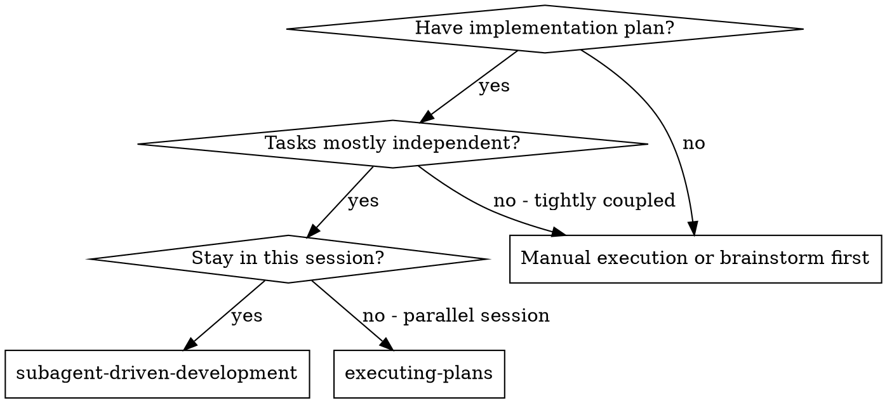

# Subagent-Driven Development

Execute plan by dispatching fresh subagent per task, with a spec compliance review after each task, then a single batched code quality review over the whole implementation at the end. Hard tasks (typically opus-tier) additionally get their own code quality review right after the task, so their risk is caught early rather than only in the final batch. (Trivial modification tasks are exempt from the per-task spec review — see DAG Execution Principles.)

**Why subagents:** You delegate tasks to specialized agents with isolated context. By precisely crafting their instructions and context, you ensure they stay focused and succeed at their task. They should never inherit your session's context or history — you construct exactly what they need. This also preserves your own context for coordination work.

**Core principle:** Fresh subagent per task + per-task spec review (+ a per-task code quality review for hard tasks) + one batched code quality review at the end + **DAG ready-set parallel dispatch** = high quality, fast iteration

**Continuous execution:** Do not pause to check in with your human partner between tasks. Execute all tasks from the plan without stopping. The only reasons to stop are: BLOCKED status you cannot resolve, a plan defect (e.g. two concurrently-ready tasks touching the same file), ambiguity that genuinely prevents progress, or all tasks complete. "Should I continue?" prompts and progress summaries waste their time — they asked you to execute the plan, so execute it.

## When to Use



**vs. Executing Plans (parallel session):**
- Same session (no context switch)
- Fresh subagent per task (no context pollution)
- Spec compliance review after each task (plus a per-task code quality review for hard opus-tier tasks); code quality reviewed in one batch at the end
- DAG ready-set parallel dispatch (lanes run concurrently)
- Faster iteration (no human-in-loop between tasks)

## The Process

```dot
digraph process {
    rankdir=TB;

    "Read plan, parse DAG (tasks, IDs, depends_on), create TodoWrite" [shape=box];
    "Print one-line task summary (see below)" [shape=box];
    "Compute ready-set" [shape=box];
    "Ready-set empty AND nothing in flight (implementers + per-task reviews)?" [shape=diamond];
    "Dispatch ALL ready tasks concurrently, one lane each" [shape=box];
    "Dispatch batched code quality reviewer for entire implementation (./code-quality-reviewer-prompt.md)" [shape=box];
    "Code quality reviewer approves?" [shape=diamond];
    "Dispatch fix subagent for quality issues, re-review" [shape=box];
    "Dispatch final whole-implementation review (integration + plan completeness, code quality carved out)" [shape=box];
    "Final review approves?" [shape=diamond];
    "Dispatch fix subagent for final-review issues, re-review" [shape=box];
    "Use superpowers:finishing-a-development-branch" [shape=box style=filled fillcolor=lightgreen];

    subgraph cluster_lane {
        label="Per Lane (runs concurrently with other lanes)";
        "Dispatch implementer subagent (./implementer-prompt.md)" [shape=box];
        "Implementer asks questions?" [shape=diamond];
        "Answer questions, re-dispatch" [shape=box];
        "Implementer implements, tests, commits, self-reviews" [shape=box];
        "Eager-recompute ready-set (commit unblocks dependents)" [shape=box];
        "Trivial haiku modification task?" [shape=diamond];
        "Dispatch spec reviewer (./spec-reviewer-prompt.md)" [shape=box];
        "Spec reviewer approves?" [shape=diamond];
        "Implementer fixes spec gaps" [shape=box];
        "Hard (opus-tier) task?" [shape=diamond];
        "Dispatch per-task code quality reviewer (./code-quality-reviewer-prompt.md)" [shape=box];
        "Per-task code quality reviewer approves?" [shape=diamond];
        "Implementer fixes quality issues" [shape=box];
        "Task reviews passed (mark task complete in TodoWrite)" [shape=box];
    }

    "Read plan, parse DAG (tasks, IDs, depends_on), create TodoWrite" -> "Print one-line task summary (see below)";
    "Print one-line task summary (see below)" -> "Compute ready-set";
    "Compute ready-set" -> "Ready-set empty AND nothing in flight (implementers + per-task reviews)?";
    "Ready-set empty AND nothing in flight (implementers + per-task reviews)?" -> "Dispatch batched code quality reviewer for entire implementation (./code-quality-reviewer-prompt.md)" [label="yes"];
    "Ready-set empty AND nothing in flight (implementers + per-task reviews)?" -> "Dispatch ALL ready tasks concurrently, one lane each" [label="no"];
    "Dispatch ALL ready tasks concurrently, one lane each" -> "Dispatch implementer subagent (./implementer-prompt.md)";

    "Dispatch implementer subagent (./implementer-prompt.md)" -> "Implementer asks questions?";
    "Implementer asks questions?" -> "Answer questions, re-dispatch" [label="yes"];
    "Answer questions, re-dispatch" -> "Dispatch implementer subagent (./implementer-prompt.md)";
    "Implementer asks questions?" -> "Implementer implements, tests, commits, self-reviews" [label="no"];

    "Implementer implements, tests, commits, self-reviews" -> "Eager-recompute ready-set (commit unblocks dependents)";
    "Eager-recompute ready-set (commit unblocks dependents)" -> "Compute ready-set";
    "Implementer implements, tests, commits, self-reviews" -> "Trivial haiku modification task?" [label="review track (concurrent, non-blocking)"];
    "Trivial haiku modification task?" -> "Task reviews passed (mark task complete in TodoWrite)" [label="yes - skip reviews"];
    "Trivial haiku modification task?" -> "Dispatch spec reviewer (./spec-reviewer-prompt.md)" [label="no"];

    "Dispatch spec reviewer (./spec-reviewer-prompt.md)" -> "Spec reviewer approves?";
    "Spec reviewer approves?" -> "Implementer fixes spec gaps" [label="no"];
    "Implementer fixes spec gaps" -> "Dispatch spec reviewer (./spec-reviewer-prompt.md)";
    "Spec reviewer approves?" -> "Hard (opus-tier) task?" [label="yes"];
    "Hard (opus-tier) task?" -> "Task reviews passed (mark task complete in TodoWrite)" [label="no - code quality batched to end"];
    "Hard (opus-tier) task?" -> "Dispatch per-task code quality reviewer (./code-quality-reviewer-prompt.md)" [label="yes"];
    "Dispatch per-task code quality reviewer (./code-quality-reviewer-prompt.md)" -> "Per-task code quality reviewer approves?";
    "Per-task code quality reviewer approves?" -> "Implementer fixes quality issues" [label="no"];
    "Implementer fixes quality issues" -> "Dispatch per-task code quality reviewer (./code-quality-reviewer-prompt.md)";
    "Per-task code quality reviewer approves?" -> "Task reviews passed (mark task complete in TodoWrite)" [label="yes"];
    "Task reviews passed (mark task complete in TodoWrite)" -> "Compute ready-set" [label="re-check exit condition"];

    "Dispatch batched code quality reviewer for entire implementation (./code-quality-reviewer-prompt.md)" -> "Code quality reviewer approves?";
    "Code quality reviewer approves?" -> "Dispatch fix subagent for quality issues, re-review" [label="no"];
    "Dispatch fix subagent for quality issues, re-review" -> "Dispatch batched code quality reviewer for entire implementation (./code-quality-reviewer-prompt.md)";
    "Code quality reviewer approves?" -> "Dispatch final whole-implementation review (integration + plan completeness, code quality carved out)" [label="yes"];
    "Dispatch final whole-implementation review (integration + plan completeness, code quality carved out)" -> "Final review approves?";
    "Final review approves?" -> "Dispatch fix subagent for final-review issues, re-review" [label="no"];
    "Dispatch fix subagent for final-review issues, re-review" -> "Dispatch final whole-implementation review (integration + plan completeness, code quality carved out)";
    "Final review approves?" -> "Use superpowers:finishing-a-development-branch" [label="yes"];
}
```



### Task Summary at Start

After parsing the DAG and before dispatching anything, print a one-line summary of every task so your human partner can see the whole plan at a glance. One line per task, in task-ID order:

```
[T1]: aaa (depends on [], sonnet)
[T2]: bbb (depends on [T1], haiku)
[T3]: ccc (depends on [T1, T2], opus)
...
```

Each line has: the task ID in brackets, the task's one-line summary, then in parentheses its `Depends on:` list and its `Recommended agent:` from the plan. Pull the summary, dependencies, and agent straight from each task's fields in the plan document. If a task has no recommended agent in the plan, choose one using the Model Selection rules below and note it.

### DAG Execution Principles

- **Lanes run in parallel; each lane is serial.** Inside a single lane, the implementer → spec review steps run in order, followed by a per-task code quality review for hard (opus-tier) tasks only. For haiku/sonnet tasks, code quality is not reviewed per lane — it runs once at the end over the whole implementation. Across lanes, the per-task pipelines run concurrently. There is no parallelism *within* a task — only across independent tasks.
- **Implementation commit unblocks dependents — the per-task reviews do not gate them.** Neither the spec review nor a hard task's per-task code quality review is on the critical path. The instant an implementer commits, treat its task as implementation-complete: recompute the ready-set and dispatch any newly-unblocked dependents immediately, *while that task's spec review (and, for hard tasks, its per-task code quality review) runs concurrently*. Dependents build on the committed code, not on the reviewed-and-blessed code. This is the main lever for speed — a passing review rarely changes the code, so blocking downstream work on it wastes the parallelism the DAG made available.
- **Eager recomputation.** Recompute the ready-set the instant any implementer commits (this unblocks its dependents) and again whenever a review track finishes (to re-check the exit condition). Do NOT wait for the rest of the current round to complete.
- **When a review demands a change, you decide where the fix lands — never revert or block.** Reviews still matter: you never skip them, and you never finish the branch with open review issues. But because dependents may already be in flight, handle each finding by scope:
  - *Isolated to the reviewed task* (fix touches only that task's files): the same implementer fixes it, re-review, done. Dependents are unaffected.
  - *Breaking change that ripples into already-dispatched dependents* (e.g. an interface the dependents consumed changed): **you, the main agent, coordinate the fix directly.** Do NOT revert the dependent lanes or unwind the DAG. Let the in-flight lanes finish, then dispatch a follow-up fix — a new task or a targeted fix subagent — that reconciles the dependents with the corrected interface. A breaking finding is a normal event to absorb, not a reason to serialize the whole plan.
- **Concurrent commits will race — retry, never amend.** Multiple lanes commit to the same branch at once, so a commit can fail on a git lock or a non-fast-forward. That is expected: wait briefly and retry the commit, up to three attempts — the race almost always clears. Never rewrite shared history with `git commit --amend` or `git rebase` inside a lane; amending while other lanes commit scrambles the history for everyone. Always add a new commit. (Implementers get this instruction directly in `./implementer-prompt.md`.)
- **The DAG is the truth.** Concurrent lane safety depends entirely on the plan's DAG correctly expressing dependencies. If two ready tasks would modify the same file, that is a **plan defect** — stop, report it to the user, and do not paper over it by serializing dispatch.
- **Optional cleanup suggestions are still worth doing — "non-blocking" is not "ignore."** A subagent (implementer or reviewer) will sometimes report an improvement it labels non-blocking or nice-to-have: a clearer name, a small dedup, a tidier structure. Non-blocking means it doesn't stop the merge — it does NOT mean skip it. Keeping the codebase clean pays off: the small cleanup now is far cheaper than the confusion, duplication, and rework it prevents later, so the total cost goes down even if it costs a little more right now. Default to applying these suggestions (via the same implementer, in scope) rather than dropping them. Only defer one when it's genuinely out of scope or large enough to deserve its own task — and when you defer, record it as a follow-up instead of silently discarding it.
- **Skip the per-task spec review for trivial modification tasks.** When a task is a simple modification — typically a `haiku`-tier task that only lightly edits existing code exactly as the plan spells out — do NOT dispatch the spec reviewer. The implementer's own self-review is enough; mark the task complete once it commits. This exception is only for genuinely mechanical, low-risk edits with a complete spec. If the task involves any real judgment, new logic, multi-file coordination, or an unclear spec, run the spec review as normal. When in doubt, review. (The end-of-plan batched code quality review still covers these trivial tasks along with everything else — the exception only skips the per-task *spec* review.)

## Model Selection

**Implementer model — follow the plan.** Each task carries a `Recommended agent:` tier (haiku | sonnet | opus) chosen when the plan was written; dispatch the implementer with that model. Only override it when the plan clearly misjudged the difficulty, and say why.

**If a task has no recommended agent**, pick the least powerful model that can handle it — this conserves cost and increases speed:
- Mechanical work with a complete spec, 1-2 files (boilerplate, renames, well-specified functions) → cheap model (haiku)
- Ordinary implementation with some judgment (typical features, multi-file integration, debugging) → standard model (sonnet)
- Design judgment, tricky algorithms, or broad codebase understanding → most capable model (opus)

**Per-task reviewer model — follow the task's designated tier.** By default, dispatch a task's spec reviewer — and, for hard opus-tier tasks, its per-task code quality reviewer — with the **same model as the task's `Recommended agent`**. A haiku task gets a haiku spec reviewer; an opus task gets opus reviewers; and so on. Do NOT auto-escalate a per-task review to the most capable model. Only reach for a stronger reviewer when there is a specific reason (e.g. the task is subtle, high-risk, or the implementer flagged doubts), and say why.

**End-of-plan reviewer model — use a capable model.** The batched code quality review and the final whole-implementation review each cover the entire implementation across every task, so dispatch both with the most capable model (`opus`) by default. These are the last quality gates before merge; don't cut them short with a cheap model.

## Handling Implementer Status

Implementer subagents report one of four statuses. Handle each appropriately:

**DONE:** Proceed to spec compliance review (or, for a trivial task exempt from the spec review, mark it complete). After the spec review passes, run a per-task code quality review only if the task is hard (opus-tier); haiku/sonnet tasks defer code quality entirely to the end-of-plan batch.

**DONE_WITH_CONCERNS:** The implementer completed the work but flagged doubts. Read the concerns before proceeding. If the concerns are about correctness or scope, address them before review. If they're optional cleanup suggestions (e.g., "this file is getting large", "this name could be clearer"), don't just note them and move on — apply the ones that are cheap and in scope, and only defer the rest as a recorded follow-up (see "Optional cleanup suggestions are still worth doing").

**NEEDS_CONTEXT:** The implementer needs information that wasn't provided. Provide the missing context and re-dispatch.

**BLOCKED:** The implementer cannot complete the task. Assess the blocker:
1. If it's a context problem, provide more context and re-dispatch with the same model
2. If the task requires more reasoning, re-dispatch with a more capable model
3. If the task is too large, break it into smaller pieces
4. If the plan itself is wrong, escalate to the human

**Never** ignore an escalation or force the same model to retry without changes. If the implementer said it's stuck, something needs to change.

## Prompt Templates

- `./implementer-prompt.md` - Dispatch implementer subagent (per task)
- `./spec-reviewer-prompt.md` - Dispatch spec compliance reviewer subagent (per task)
- `./code-quality-reviewer-prompt.md` - Dispatch the code quality reviewer. Used twice: per-task for hard opus-tier tasks (right after the task's spec review passes, scoped to that task's commits), and once at the end over the entire implementation (BASE_SHA = where the branch started, HEAD_SHA = the final commit)

After the batched code quality review passes, run the final whole-implementation review using the code-reviewer template from superpowers:requesting-code-review (BASE_SHA = where the branch started, HEAD_SHA = the final commit). **Carve code quality out of this final review to keep the two roles distinct:** the code quality review above already covers cleanliness, tests, maintainability, and file organization. Scope the final review to the whole-implementation concerns that per-task reviews can't see — end-to-end plan/requirements completeness, how the tasks integrate with each other, architecture soundness, production readiness, and the merge verdict. Tell the reviewer not to redo the line-by-line code-quality and testing audit.

## Example Workflow

```
You: I'm using Subagent-Driven Development to execute this plan.

[Read plan file once: docs/superpowers/YYYY-MM-DD/<topic>/plan.md]
[Parse DAG: T1 (deps: []), T2 (deps: []), T3 (deps: [T1]), T4 (deps: [T2, T3])]
[Create TodoWrite with all 4 tasks]

[Print task summary]
[T1]: Add config loader (depends on [], sonnet)
[T2]: Add HTTP client wrapper (depends on [], sonnet)
[T3]: Wire loader into client (depends on [T1], haiku)
[T4]: Add retry + backoff layer (depends on [T2, T3], opus)

Round 1: ready-set = {T1, T2}
[Dispatch T1 lane and T2 lane concurrently]

T1 lane: implementer asks "use user-level or system-level?"
You: "User level"
T1 implementer: implements, tests, commits, self-reviews

[T1 committed → eager recompute: ready-set = {T3} (T2 still in flight)]
[Dispatch T3 lane immediately — T1's spec review runs concurrently,
 it does NOT block T3]

T1 spec reviewer: ✅   (running alongside T3)
T1 spec review passed.

T2 lane (still running): implementer commits
[T2 committed → eager recompute: ready-set = {} (T4 waits on T3); T3 still in flight]
T2 spec reviewer: ❌ Missing progress reporting
  → Isolated to T2's files, so the T2 implementer fixes it; no dependent affected.
T2 implementer: fixes
T2 spec reviewer: ✅
T2 spec review passed.

T3 lane: implementer commits
[T3 committed → eager recompute: ready-set = {T4}]
[Dispatch T4 lane]
[T3 is a trivial haiku wiring edit → skip the spec review, complete on commit]
T4 implementer commits; T4 spec reviewer (opus, matching T4's tier): ✅
[T4 is opus-tier (hard) → also run a per-task code quality review now]
T4 per-task code quality reviewer (opus): ✅
T4 reviews passed.

[Ready-set empty, no implementers or per-task reviews in flight → exit main loop]

[Dispatch batched code quality reviewer over the whole implementation (opus)]
Code quality reviewer: ⚠ config loader and client wrapper duplicate a small helper
  → Dispatch a fix subagent to dedup it, re-run the code quality review.
Code quality reviewer: ✅

[Dispatch final whole-implementation review (opus) — integration + plan
 completeness, code quality already covered above]
Final reviewer: All plan requirements met, tasks integrate cleanly, ready to merge

Done!

(Breaking-change case: if T1's spec review had instead found that T1's public
interface must change — and T3 already consumed that interface — you would NOT
revert T3. You let T3 finish, then dispatch a follow-up fix reconciling T3 with
T1's corrected interface.)
```

## Red Flags

**Never:**
- Start implementation on main/master branch without explicit user consent
- Skip the per-task spec compliance review — **except** for trivial `haiku`-tier modification tasks, where it is skipped by design (see "Skip the per-task spec review for trivial modification tasks")
- Skip the end-of-plan batched code quality review, or finish the branch before it passes (it is the code quality gate for the whole implementation and is never skipped)
- Proceed with unfixed issues
- Make subagent read plan file (provide full text instead)
- Skip scene-setting context (subagent needs to understand where task fits)
- Ignore subagent questions (answer before letting them proceed)
- Accept "close enough" on spec compliance (spec reviewer found issues = not done)
- Skip review loops (reviewer found issues = fix = review again)
- Let implementer self-review replace actual review (both are needed)
- **Run a per-task code quality review for a non-hard task** (only hard opus-tier tasks get one; haiku/sonnet tasks' code quality is covered solely by the end-of-plan batch)
- Hold back a ready dependent because its dependency's spec review hasn't finished (the *commit* unblocks dependents — the spec review runs concurrently and never gates downstream work)
- Revert or unwind an already-dispatched dependent lane because a review found a breaking change (let it finish; you reconcile it with a follow-up fix)
- Amend, rebase, or otherwise rewrite shared history in a lane, or give up on a racing commit after a single failure — retry up to three times, always add new commits (implementers get the full instruction via `./implementer-prompt.md`)
- Finish the branch while any task's spec review, a hard task's per-task code quality review, the batched code quality review, or the final whole-implementation review still has open issues
- Dispatch a task whose dependencies haven't all committed their implementation
- Allow two concurrent lanes to touch the same file (this means the plan's DAG is wrong — stop and flag it to the user)
- Wait for the entire ready-set to finish before computing the next one (defeats DAG parallelism — recompute eagerly the moment any implementer commits)

**If subagent asks questions:**
- Answer clearly and completely
- Provide additional context if needed
- Don't rush them into implementation

**If reviewer finds issues:**
- Implementer (same subagent) fixes them
- Reviewer reviews again
- Repeat until approved
- Don't skip the re-review

**If subagent fails task:**
- Dispatch fix subagent with specific instructions
- Don't try to fix manually (context pollution)

## Integration

**Required workflow skills:**
- **superpowers:using-git-worktrees** - Ensures isolated workspace (creates one or verifies existing)
- **superpowers:writing-plans** - Creates the plan this skill executes
- **superpowers:requesting-code-review** - Code review template for reviewer subagents
- **superpowers:finishing-a-development-branch** - Complete development after all tasks

**Subagents should use:**
- **superpowers:test-driven-development** - only when a task explicitly calls for TDD; the plan decides per task (experiments, scaffolding, and hard- or expensive-to-test code usually don't warrant it)

**Alternative workflow:**
- **superpowers:executing-plans** - Use for parallel session instead of same-session execution
