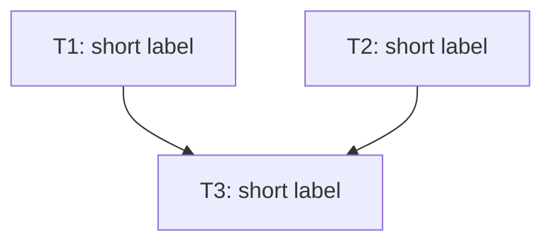

# Writing Plans (Fable)

## Overview

Write implementation plans that **define the box, not the brushstrokes**. The plan will be executed by superpowers:subagent-driven-development-fable, where a Fable main agent dispatches each task — that dispatcher reads context well and writes good subagent prompts, so the plan does not need to pre-chew every detail. Your job is to make the *what* unambiguous and leave the *how* to execution wherever the how is ordinary.

For each task, nail down: the goal, the files it owns, the interfaces/contracts it must expose or respect, non-obvious constraints, and what "done" means. Spend detail where a wrong guess is likely or expensive — novel algorithms, tricky invariants, cross-task contracts. Skip detail where any competent implementation is fine. DRY. YAGNI. Frequent commits. Write down in Korean(한국어로 계획을 생성하세요).

**Announce at start:** "I'm using the writing-plans-fable skill to create the implementation plan."

**Context:** If working in an isolated worktree, it should have been created via the `superpowers:using-git-worktrees` skill at execution time.

**Save plans to:** `docs/superpowers/YYYY-MM-DD/<topic>/plan.md` — the same `YYYY-MM-DD/<topic>/` directory as the spec (`spec.md`), do not commit this plan file.
- (User preferences for plan location override this default)

## Scope Check

If the spec covers multiple independent subsystems, it should have been broken into sub-project specs during brainstorming. If it wasn't, suggest breaking this into separate plans — one per subsystem. Each plan should produce working, testable software on its own.

## Dependency DAG

Before defining tasks, identify every task and the artifacts each one produces. For each task, list which earlier tasks' artifacts it depends on. Use these edges to build a **DAG** over the tasks.

- If you find a cycle, your decomposition is wrong — split or merge tasks until the dependencies form a DAG.
- **Tasks that can be ready at the same time MUST modify disjoint sets of files.** If two tasks that could become ready concurrently would touch the same file, add a dependency edge to serialize them. Concurrent lanes touching the same file are a plan defect, not an executor problem.
- A purely linear chain (T1 → T2 → T3) is a valid DAG — the executor simply gets a ready-set of size 1 each round.

The DAG appears in two forms that must agree: a Mermaid diagram in the header (overview) and explicit `Depends on:` fields on each task (per-task ground truth).

## File Structure

Map out which files will be created or modified and what each is responsible for — this is where decomposition gets locked in, and it's what makes the disjoint-files rule checkable. Exact file paths are still required; **line numbers and exact edit locations are not** — naming the file and describing the change is enough.

- Each file should have one clear responsibility with a well-defined interface. Prefer smaller, focused files.
- In existing codebases, follow established patterns. If a file you're modifying has grown unwieldy, including a split in the plan is reasonable.

## Task Granularity

A task is a **coherent unit of work that ends in a commit** — not a micro-script. Don't decompose a task into 2-minute steps; give it a handful of meaningful checkpoints (implement, verify, commit). The implementer decides the fine-grained order of operations.

Decide per task whether tests are warranted, and say so in the task. When they are, state **what behavior the tests must verify** (the cases that matter, expected outcomes at the level of intent) — don't enumerate every assertion, and don't prescribe per-step smoke tests. Only prescribe TDD when the user explicitly asked for it.

## Plan Document Header

**Every plan MUST start with this header:**

```markdown
# [Feature Name] Implementation Plan

> **For agentic workers:** REQUIRED SUB-SKILL: Use superpowers:subagent-driven-development-fable (recommended) or superpowers:executing-plans to implement this plan task-by-task. Steps use checkbox (`- [ ]`) syntax for tracking.

**Goal:** [One sentence describing what this builds]

**Architecture:** [2-3 sentences about approach]

**Tech Stack:** [Key technologies/libraries]

## Dependency Graph



The edges in this diagram MUST exactly match the `Depends on:` fields in each task below. **Every node MUST carry its label (`TN[TN: short label]`), including when it only appears on the right side of an arrow** — never write a bare node ID.

---
```

## Task Structure

````markdown
### Task TN: [Component Name]

**ID:** TN
**Depends on:** [TA, TB]
**Difficulty:** [one sentence or less describing how hard this task is and why]
**Recommended agent:** haiku | sonnet | opus

**Files:**
- Create: `exact/path/to/file.py`
- Modify: `exact/path/to/existing.py`

**Goal:** [What this task delivers and why it exists in the plan]

**Contract:** [Interfaces this task exposes or must respect — signatures, types, endpoints, data shapes that other tasks or existing code depend on]

**Constraints:** [Non-obvious requirements, invariants, gotchas, docs to consult — only what the implementer can't infer from the codebase]

- [ ] Implement per the goal and contract above
- [ ] [Tests, if warranted: the behaviors to verify]
- [ ] **Commit** (`feat: ...`)
````

Rules:
- `ID:` must be unique and match a node in the Mermaid diagram; the union of `Depends on:` fields must exactly match the diagram's edges. Use `[]` for tasks with no dependencies.
- Tasks with overlapping file scopes MUST have a dependency edge between them.
- `Difficulty:` one sentence so the executor knows what it's walking into.
- `Recommended agent:` the cheapest model that can do the task reliably — **haiku** (mechanical, low-judgment work), **sonnet** (ordinary implementation with some judgment), **opus** (deep reasoning: tricky algorithms, cross-cutting design, subtle correctness). Match it to the difficulty you wrote.
- **Contracts are the one place to be pedantic.** Anything two tasks (or a task and existing code) must agree on — names, signatures, formats — gets written down exactly. A loose goal is recoverable; a mismatched interface between parallel lanes is not.
- Pseudo-code is a tool, not a requirement: include it only where the intended logic is genuinely non-obvious (a specific algorithm, a subtle state machine). For ordinary code, the Goal + Contract + Constraints are the spec.

## What Still Counts as a Plan Failure

Looser does not mean vague about *what*. These remain failures:
- "TBD", "TODO", or requirements left undecided — every decision the spec settled must be settled here too
- Ambiguous goals that two reasonable implementers would build differently *in ways that matter* — if the difference matters, constrain it; if it doesn't, explicit delegation is fine ("choose the idiomatic error-handling style for this codebase" is OK; "handle errors" with no context for what can fail is not)
- References to types, functions, or contracts not defined in any task or in the existing codebase
- "Similar to Task N" as the entire description (tasks may be read out of order)

## Self-Review

After writing the complete plan, check it against the spec with fresh eyes — a checklist you run yourself, not a subagent dispatch:

1. **Spec coverage:** every spec requirement maps to a task. Add tasks for gaps.
2. **Contract consistency:** names, signatures, and types referenced across tasks match where they're defined.
3. **DAG integrity:** diagram edges == `Depends on:` fields; concurrent-ready tasks touch disjoint files.

Fix issues inline and move on — no re-review loop.

## Execution Handoff

**REQUIRED SUB-SKILL:** Use `superpowers:subagent-driven-development-fable` (same-session execution, the default). Use `superpowers:executing-plans` only when the plan will be executed in a separate session.

The plan's DAG tells the executor which tasks can run in parallel; the dispatch algorithm (ready-sets, lanes, reviews) belongs to the executor skill.
