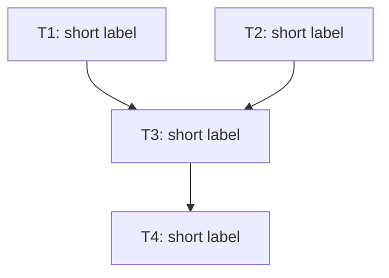

# Writing Plans

## Overview

Write comprehensive implementation plans assuming the engineer has zero context for our codebase and questionable taste. Document everything they need to know for each task: which files to touch, the intended logic (pseudo-code or a concrete explanation — see Code convention below), docs they might need to check, and how to test it. Give them the whole plan as bite-sized tasks. DRY. YAGNI. Frequent commits. Write down in Korean(한국어 계획을 생성하세요). 

Assume they are a skilled developer, but know almost nothing about our toolset or problem domain. Assume they don't know good test design very well.

**Announce at start:** "I'm using the writing-plans skill to create the implementation plan."

**Context:** If working in an isolated worktree, it should have been created via the `superpowers:using-git-worktrees` skill at execution time.

**Save plans to:** `docs/superpowers/YYYY-MM-DD/<topic>/plan.md` — the same `YYYY-MM-DD/<topic>/` directory as the spec (`spec.md`), do not commit this plan file. 
- (User preferences for plan location override this default)

## Scope Check

If the spec covers multiple independent subsystems, it should have been broken into sub-project specs during brainstorming. If it wasn't, suggest breaking this into separate plans — one per subsystem. Each plan should produce working, testable software on its own.

## Dependency DAG

Before defining tasks, identify every task and the artifacts each one produces. For each task, list which earlier tasks' artifacts it depends on. Use these edges to build a **DAG** (directed acyclic graph) over the tasks.

- If you find a cycle, your decomposition is wrong — go back and split or merge tasks until the dependencies form a DAG.
- **Tasks that can be ready at the same time MUST modify disjoint sets of files.** If two tasks that could become ready concurrently would touch the same file, add a dependency edge to serialize them. Concurrent lanes touching the same file are a plan defect, not an executor problem.
- A purely linear chain (T1 → T2 → T3) is a valid DAG. The executor will simply have a ready-set of size 1 each round. There is no separate "linear" mode.

The DAG is then expressed in two complementary forms in the plan document: a Mermaid diagram in the header (overview) and explicit `Depends on:` fields on each task (per-task ground truth). Both must agree.

## File Structure

Before defining tasks, map out which files will be created or modified and what each one is responsible for. This is where decomposition decisions get locked in.

- Design units with clear boundaries and well-defined interfaces. Each file should have one clear responsibility.
- You reason best about code you can hold in context at once, and your edits are more reliable when files are focused. Prefer smaller, focused files over large ones that do too much.
- Files that change together should live together. Split by responsibility, not by technical layer.
- In existing codebases, follow established patterns. If the codebase uses large files, don't unilaterally restructure - but if a file you're modifying has grown unwieldy, including a split in the plan is reasonable.

This structure informs the task decomposition. Each task should produce self-contained changes that make sense independently.

## Bite-Sized Task Granularity

**Each step is one action (2-5 minutes):**
- "Implement the pseudo-code" - step
- "Revise the code & find out points to refactor" - step
- "Fix the found points" - step
- "Commit" - step

## Plan Document Header

**Every plan MUST start with this header:**

```markdown
# [Feature Name] Implementation Plan

> **For agentic workers:** REQUIRED SUB-SKILL: Use superpowers:subagent-driven-development (recommended) or superpowers:executing-plans to implement this plan task-by-task. Steps use checkbox (`- [ ]`) syntax for tracking.

**Goal:** [One sentence describing what this builds]

**Architecture:** [2-3 sentences about approach]

**Tech Stack:** [Key technologies/libraries]

## Dependency Graph



The edges in this diagram MUST exactly match the `Depends on:` fields in each task below. Node IDs in the diagram are the same task IDs used in task headers.

**Every node MUST carry its label (`TN[TN: short label]`), including when it only appears on the right side of an arrow.** Never reference a bare node ID (e.g. `T1 --> T3`) — always write the full labeled form on both ends so the diagram is readable on its own.

---
```

## Task Structure

````markdown
### Task TN: [Component Name]

**ID:** TN
**Depends on:** [TA, TB, TC]
**Difficulty:** [one sentence or less describing how hard this task is and why]
**Recommended agent:** haiku | sonnet | opus

**Files:**
- Create: `exact/path/to/file.py`
- Modify: `exact/path/to/existing.py:123-145`

- [ ] Write minimal implementation

```python
def fibonacci_add_one(n):
    # Compute the n-th Fibonacci number (fib(0)=0, fib(1)=1)
    # by looping n times updating (a, b) -> (b, a + b),
    # then return that number plus one.
```

- [ ] **Commit**

```bash
git commit -m "feat: add fibonacci add one computing method"
```
````

Rules:
- `ID:` must be unique across the plan and must match a node ID in the Mermaid Dependency Graph at the top.
- `Depends on:` is a list of other task IDs. Use `[]` for tasks with no dependencies — these become ready immediately in the first round.
- The set of edges across all `Depends on:` fields MUST exactly match the edges in the Mermaid diagram.
- Tasks with overlapping file scopes MUST have a dependency edge between them (see "Dependency DAG" section above).
- `Difficulty:` is a single sentence (or less) stating how hard the task is and, briefly, why — so the executor knows what it's walking into.
- Decide per task whether tests are warranted, and say so explicitly in the task's steps; don't prescribe tests for experiments, scaffolding, or code that is fundamentally hard or expensive to test.
- Only prescribe a TDD flow (a "Write the failing test" step before implementation) when the user explicitly asked for TDD in their request or spec. Otherwise, if a task warrants tests, write them as a normal step after the implementation — do not default to test-first ordering.
- `Recommended agent:` picks the cheapest model that can do the task reliably, one of `haiku`, `sonnet`, or `opus`:
  - **haiku** — mechanical, low-judgment work: boilerplate, simple renames, wiring up a well-specified function, trivial edits.
  - **sonnet** — ordinary implementation with some judgment: typical feature tasks, moderate refactors, straightforward tests.
  - **opus** — hard tasks needing deep reasoning: tricky algorithms, cross-cutting design, subtle concurrency/correctness, ambiguous or high-risk changes.
  - Match the model to the difficulty you wrote — don't reach for opus on a trivial task or haiku on a subtle one.

## No Placeholders

Every step must contain the actual content an engineer needs. These are **plan failures** — never write them:
- "TBD", "TODO"
- "Add appropriate error handling" / "add validation" / "handle edge cases"
- "Write tests for the above" (without naming the concrete cases and expected results)
- "Similar to Task N" (the engineer may be reading tasks out of order)
- Steps that describe what to do without showing how (at least pseudo-code or a concrete explanation is required)
- References to types, functions, or methods not defined in any task

## Remember
- Exact file paths always
- Exact commands with expected output
- DRY, YAGNI, frequent commits

## Code convention

This is a PLAN — do not write complete code. If full code were wanted, the user would have asked you to edit the code directly instead of writing a plan.
- You can use pseudo-code if you want. If you use pseudo-code, make sure that it is self-contained (concrete enough).
- Make sure that you specify the scope. You should give a well-defined box if you want to make subagent to fill it. 
- Repetitive implementation can be omitted if you provide concrete enough information.

### What's OK (Example)

You should implement a method that implements path-finding logic with Dijkstra's algorithm.
- Signature: `int dijkstra(Graph &G, Distance &D, int start, int goal)` 
- Use a min-heap: `std::priority_queue` over `std::pair<int,int>` with `std::greater` as the comparator.
Pseudo-code: 
1. Define a priority queue with the above type
2. Put the start vertex in the queue
3. Repeat retrieving the minimum-distance vertex from the queue and relaxing its neighbors
4. Return the answer.

### What's not OK (Example)

You should implement pathfinding algorithm.
- Use Dijkstra.
- Get start/end vertices and use them.

---

This is not okay because: 
- At least one of these is required: 1) pseudo-code or 2) a concrete explanation. This task contains neither.
- The scope is ambiguous (no signature, no sufficient explanation). The subagent is very likely to escape the box.

## Self-Review

After writing the complete plan, look at the spec with fresh eyes and check the plan against it. This is a checklist you run yourself — not a subagent dispatch.

**1. Spec coverage:** Skim each section/requirement in the spec. Can you point to a task that implements it? List any gaps.

**2. Placeholder scan:** Search your plan for red flags — any of the patterns from the "No Placeholders" section above. Fix them.

**3. Type consistency:** Do the types, method signatures, and property names you used in later tasks match what you defined in earlier tasks? A function called `clearLayers()` in Task 3 but `clearFullLayers()` in Task 7 is a bug.

If you find issues, fix them inline. No need to re-review — just fix and move on. If you find a spec requirement with no task, add the task.

## Execution Handoff

**REQUIRED SUB-SKILL:** Use `superpowers:subagent-driven-development` (same-session execution, the default). Use `superpowers:executing-plans` only when the plan will be executed in a separate session — the same choice offered in the plan header.

The plan's DAG tells the executor which tasks can run in parallel; the dispatch algorithm itself (ready-sets, lanes, reviews) belongs to the executor skill. There is no Linear vs Parallel choice when writing the plan — a linear chain is just a DAG whose ready-set has size 1 each round, and the same skill handles both shapes.

